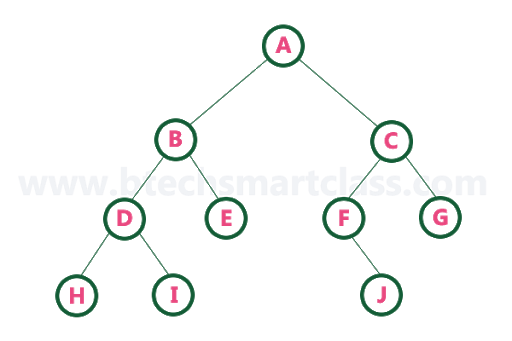

<!-- PROJECT LOGO -->
<br />
<p align="center">
  <a href="https://github.com/yohanalexander/graph-tree">
    
  </a>

  <h1 align="center">Graph Tree</h1>

  <p align="center">
    Visualização gráfica de árvores!
    <br />


<!-- ABOUT THE PROJECT -->
## Sobre o projeto

Implementação interativa em linha de comando de árvores binárias, árvores de busca, árvores com costura e árvores heap.

<!-- GETTING STARTED -->
## Funcionamento

### Pré-requisitos

Para o funcionamento adequado são necessárias ferramentas para compilação de código C e um pacote (Graphviz)  para desenhar gráficos especificados nos scripts de linguagem do DOT.
* GCC
* Make
* Graphviz

Em sistemas linux utilize os comandos no terminal:
```sh
sudo apt install build-essential
sudo apt install make
sudo apt install graphviz
```

### Compilação

Com as ferramentas instaladas para compilar o arquivo basta utilizar o comando `make` :
```sh
make
```
Caso queira limpar os arquivos de compilação use `make clean` :
```sh
make clean
```
Para desenhar os gráficos em `.png` use `make dot` :
```sh
make dot
```

<!-- USAGE EXAMPLES -->
### Uso
Utilize os gatilhos no terminal para modificar a árvore de forma interativa :
```sh
###### ThreadedTree-Visualizer ######

1 -> Inserir valor
2 -> Buscar valor
3 -> Remover valor
4 -> Imprimir árvore
0 -> Finalizar o programa

>>>
```

